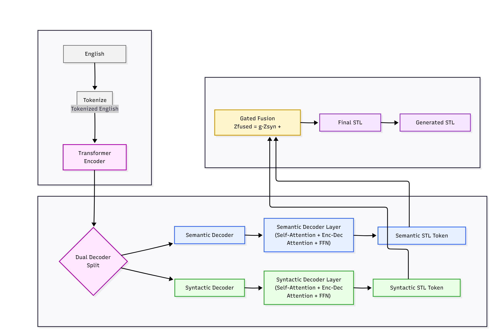
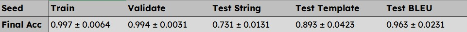

# English-to-STL Dual Decoder Transformer

## 📝 Introduction: English → STL Translation

Signal Temporal Logic (STL) is widely used in robotics, autonomous systems, and cyber-physical systems to formally specify behaviors over time. Manually writing STL formulas is difficult, requires expertise, and is error‑prone.

This project provides an **automatic translation system** that converts **natural English instructions** into precise **STL formulas** using a specially designed **Dual‑Decoder Transformer model**. The model separates semantic meaning and syntactic structure, ensuring accurate and grammatically valid STL outputs.

Below is the full architecture, file structure, usage instructions, and examples.

This repository implements an **English → STL (Signal Temporal Logic)** translation system using a **Dual-Decoder Transformer** architecture. It contains all modules required for preprocessing, training, validation, testing, beam search decoding, and evaluation.

The model architecture, training flow, and performance results are summarized below along with instructions on how to run the code.

---

## 📌 Architecture Overview



**Key idea:** The model uses a shared encoder and two decoders:

* **Semantic Decoder** → captures semantic meaning
* **Syntactic Decoder** → captures STL grammar structure
* **Gated Fusion** blends both representations to generate final STL.

---

## 📂 Project File Structure

```
NLP/
├── data_preprocessing/
├── subword/
│   ├── dataset/
│   └── tokenizer/
├── public/
├── str_process/
├── test_cases/
├── transformer/
│   ├── model/
│   │   ├── add_norm.py
│   │   ├── ffn.py
│   │   ├── transformer_encoder.py
│   │   ├── dual_transformer_decoder.py
│   ├── test/
│   │   ├── predict_greedy.py
│   │   ├── transformer_predict_beam.py
│   ├── train_validate/
│   │   ├── transformer_train_dev_data_iterator.py
├── data_set/
├── subword_preprocessing.py
├── transformer_train.py
├── transformer_test.py
├── transformer_trainer_validator.py
├── utils.py
```

---

## 🔑 Main Components Explained

### **1. transformer_train.py** (Main Training Script)

* Loads dataset
* Applies tokenization & batching
* Builds the Transformer + dual decoder
* Runs training loop
* Saves checkpoints

### **2. transformer_test.py** (Evaluate on Test Set)

* Loads saved model
* Runs evaluation on string-level and template-level STL
* Reports accuracy & BLEU score

### **3. transformer_predict_beam.py** (Beam Search Inference)

* Implements beam decoding
* Produces higher-quality STL outputs compared to greedy

### **4. transformer_hyperparas.py**

* Contains all tuning parameters
* Model size, layers, dropout, learning rate, fusion weights, etc.

### **5. transformer_train_dev_data_iterator.py**

* Handles batching
* Padding, masks, teacher forcing, etc.

### **6. transformer_encoder.py**

* Standard transformer encoder
* Multi-head self-attention + FFN + AddNorm

### **7. dual_transformer_decoder.py**

* Semantic decoder
* Syntactic decoder
* Gated fusion module

---

## ▶️ How to Run

### **1. Install Requirements**

```
pip install -r requirements.txt
```

### **2. Train the Model**

```
python transformer_train.py
```

### **3. Test the Model**

```
python transformer_test.py
```
---

## 📊 Experimental Results



**Summary:**

* **Train Accuracy:** 0.997 ± 0.0064
* **Validation Accuracy:** 0.994 ± 0.0031
* **Test String Accuracy:** 0.731 ± 0.0131
* **Test Template Accuracy:** 0.893 ± 0.0423
* **BLEU Score:** 0.963 ± 0.0231

---

## 💡 English → STL Examples

### **Example 1**

**Input:**

```
The robot must reach region A within 10 seconds.
```

**Output STL:**

```
F[0,10] (robot_in_A)
```

### **Example 2**

**Input:**

```
The temperature should always stay below 80.
```

**Output STL:**

```
G (temp < 80)
```

### **Example 3**

**Input:**

```
If obstacle appears, eventually stop.
```

**Output STL:**

```
(obstacle) → F(stop)
```

---

## ✔️ Summary

This repository provides a complete implementation of an English → STL generator using a dual-decoder transformer. The system achieves high accuracy and BLEU scores and supports flexible inference via greedy or beam search.

Feel free to extend the model, add datasets, or integrate with your downstream robotics/verification tasks.
